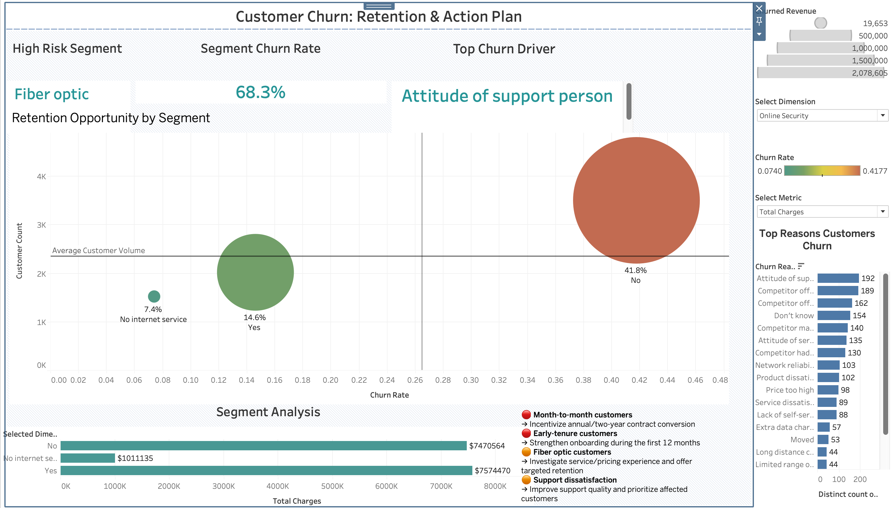

# Customer Retention Analytics — Telco Churn

An end-to-end **descriptive and inferential** analysis of telecom customer churn using Python, SQL, and Tableau. It quantifies churn rates across customer segments, statistically validates churn-related relationships, and separates *statistical significance* from *practical significance* using effect sizes.

**Scope note:** This project is analytical, not predictive — it identifies and validates **churn-related factors and high-risk segments**, not individual customer risk scores. A logistic regression / gradient-boosted classifier with per-customer churn probabilities is the natural next phase and is not yet built (see [Limitations & Next Steps](#limitations--next-steps)).
---

## Business Problem

Which customers and segments exhibit higher churn, which characteristics are associated with higher churn, and where should the company prioritize retention spend? The analysis moves beyond simple churn-rate reporting by testing whether observed patterns are statistically robust and how large their practical effect actually is.

## Stakeholders & Business Questions

| Stakeholder | Core question |
|---|---|
| Executive Leadership | What's the scale and top drivers of churn? |
| Marketing | Which segments should retention campaigns target? |
| Customer Success | Which lifecycle stage needs intervention? |
| Sales | Do contract structures reduce churn enough to push for longer terms? |
| Product | Which service lines are associated with elevated churn? |

---

## Dataset

- 7,043 customers, 33 original columns (IBM Telco Churn dataset)
- Demographics, account/contract data, service subscriptions, payment info, monthly/total charges, churn status and reason

**Data quality handling:**
- `TotalCharges` was stored as text; converted to numeric
- Blank `TotalCharges` values correspond to customers with zero tenure — kept as missing, **not imputed** (imputing would fabricate a value for customers who haven't been billed yet)
- `ChurnReason` is null for retained customers by construction, not a data defect
- Dropped `Count`, `Country`, `State`, `Lat Long` (redundant/constant fields)
- No duplicate customers found

---

## Method

1. **Data understanding** — profiling structure, types, missingness, duplicates (`01_data_understanding.ipynb`)
2. **Cleaning** — type correction, missing-value handling, validation (`02_data_cleaning.ipynb`)
3. **EDA** — churn by contract, tenure, internet service, payment method, pricing, and multi-way segment combinations, with reusable Python functions for churn summaries and segmentation (`03_eda.ipynb`)
4. **SQL analysis** — independent re-derivation of the same findings using window functions, CTEs, and views; segments under 100 customers excluded from risk rankings to avoid small-sample noise (`02_exploration.sql`)
5. **Statistical validation** — Chi-Square + Cramér's V, Welch's t-test + Cohen's d, one-way ANOVA + η² with Tukey's HSD, Pearson/Spearman correlation, all at α = 0.05 (`04_statistical_analysis.ipynb`)

Statistical significance is treated as evidence of association, not causation — this is an observational dataset with no experimental manipulation. With n=7,043, nearly every test here reaches significance regardless of practical size, which is why every p-value is reported alongside an effect size rather than alone.

---

## Key Findings

**Overall churn rate: 26.5%** (1,869 of 7,043 customers)

| Relationship | Test | Effect size | Interpretation |
|---|---|---:|---|
| Tenure → Churn | Welch's t-test | d = -0.85 | **Large** |
| Contract → Churn | Chi-Square | V = 0.41 | Moderate |
| Internet Service → Churn | Chi-Square | V = 0.32 | Moderate |
| Payment Method → Churn | Chi-Square | V = 0.30 | Moderate |
| Monthly Charges → Churn | Welch's t-test | d = 0.45 | Small |
| Total Charges → Churn | Welch's t-test | d = -0.46 | Small |
| Internet Service → Monthly Charges | ANOVA | η² = 0.82 | Large |
| Payment Method → Monthly Charges | ANOVA | η² = 0.16 | Large |
| Contract → Monthly Charges | ANOVA | η² = 0.01 | Negligible |
| Tenure ↔ Total Charges | Correlation | r = 0.83 | Strong |

Full table with p-values: [`statistical_evidence_summary.csv`](outputs/findings/statistical_evidence_summary.csv)

**Reading the table, in order of what matters most:**

- **Tenure is the strongest single factor.** Churned customers average 18.0 months tenure vs. 37.6 for retained — by far the largest effect size in the study. This points to the early lifecycle as the highest-leverage intervention window, not later-stage save efforts.
- **Contract type matters, but the effect on price doesn't come from contract type.** Month-to-month churn (42.7%) dwarfs two-year contract churn (2.8%), yet contract type explains almost none of the variance in Monthly Charges (η² = 0.006). The two effects are separable — contract length isn't just a proxy for price sensitivity.
- **Fiber optic customers churn most (41.9%) and pay the most** ($91.50/mo avg. vs. $58.10 DSL) — Internet Service accounts for approximately 82% of the variation in Monthly Charges in this ANOVA. Whether the churn is driven by price, service quality, or something correlated with who chooses fiber isn't resolved by this analysis and needs follow-up (support tickets, NPS, competitor pricing).

- **Electronic check is the highest-risk payment method** (45.3% churn vs. 15–19% for other methods) — this is the single largest gap in the payment-method breakdown and is worth investigating independently of contract/service, since it could reflect a distinct customer segment (e.g., no autopay setup) rather than the payment method itself.
- **Total Charges is confounded by tenure** (r = 0.83) — lower Total Charges among churners is mechanical (they had less time to accumulate spend), not an independent signal. Don't read it as "low lifetime value causes churn."
- **Monthly Charges has a real but modest effect** (d = 0.45) — statistically real, but roughly half the size of the tenure effect. Treat price as one input among several, not the headline explanation.

---

## Recommendations, in priority order

1. **Early-lifecycle retention** — onboarding quality and first-90-day engagement monitoring, since tenure is the largest effect in the whole analysis
2. **Month-to-month contract migration** — test incentives for one/two-year upgrades; validate they're financially sustainable against the margin lost to the discount
3. **Fiber optic investigation** — service quality, support tickets, and price positioning specifically for this segment before assuming price is the cause
4. **Electronic check segment** — investigate whether this is a payment-friction problem or a proxy for a different customer type
5. **Multi-dimensional targeting** — use Contract × Internet Service × Payment Method combinations (segments ≥100 customers) rather than single-variable rules; see [`retention_priorities.csv`](outputs/findings/retention_priorities.csv)

---

## Limitations & Next Steps

- **No predictive model.** This project validates *which* variables matter and *how strongly*, at the segment level. It does not produce a per-customer churn probability. A logistic regression baseline (interpretable, comparable coefficients to the effect sizes already computed) or a gradient-boosted classifier (better predictive performance, less interpretable) is the natural next phase.
- **No correction for multiple comparisons** Given the sample size and the emphasis on effect sizes rather than p-value thresholds alone, the main conclusions are unlikely to depend solely on statistical significance; however, formal correction for multiple comparisons would strengthen the analysis.
- **Cross-sectional, not longitudinal** — this is a single snapshot. Cohort-based tenure analysis (tracking the same customers over time) would strengthen the lifecycle argument beyond the current cross-sectional comparison.
- **Associational, not causal** — every relationship here is an association. None of the recommendations should be read as "changing X will reduce churn by Y%" without a controlled test (e.g., an A/B test on a contract-migration incentive).

---

## Dashboard

The Tableau workbook translates the analysis into two stakeholder-facing views.

### Executive Overview

Focuses on the scale and distribution of churn across the customer base.


### Retention Strategy

Focuses on high-risk segments and translates the analysis into targeted retention actions.



---

## Tech Stack

**Python** — pandas, NumPy, SciPy, statsmodels, Matplotlib, Seaborn
**SQL** — SQL Server (CTEs, window functions, views, multi-dimensional segmentation)
**Tableau** — interactive executive and segment dashboards

## Project Structure

```
customer-churn-analysis/
├── dashboard/
│   └── telco_churn.twbx
├── data/
│   ├── raw/telco_customer_churn_raw.xlsx
│   └── processed/telco_customer_churn_clean.xlsx
├── notebooks/
│   ├── 01_data_understanding.ipynb
│   ├── 02_data_cleaning.ipynb
│   ├── 03_eda.ipynb
│   └── 04_statistical_analysis.ipynb
├── sql/
│   └── 02_exploration.sql
├── outputs/findings/
│   ├── key_findings.csv
│   ├── retention_priorities.csv
│   └── statistical_evidence_summary.csv
└── README.md
```

## How to Run

### 1. Clone the repository

```bash
git clone <customer-churn-analysis>
cd customer-churn-analysis
2. Install Python dependencies

Create a virtual environment and install the required packages:

python3 -m venv .venv
source .venv/bin/activate
pip install -r requirements.txt
3. Run the Python analysis

Open the project in VS Code or Jupyter and run the notebooks in order:

01_data_understanding.ipynb — inspect the dataset and assess data quality
02_data_cleaning.ipynb — clean and validate the dataset
03_eda.ipynb — perform exploratory, bivariate, and segment analysis
04_statistical_analysis.ipynb — statistically validate the observed relationships

The notebooks use project-relative paths and do not depend on machine-specific file locations.

4. Run the SQL analysis

Load the processed dataset into SQL Server and execute:

sql/02_exploration.sql

The SQL analysis independently reproduces key churn metrics and segment-level findings using CTEs, window functions, views, and multi-dimensional segmentation.

5. Explore the Tableau dashboards

Open the Tableau workbook:

dashboard/telco_churn.twbx

in Tableau Desktop.

The workbook contains two dashboards:

Executive Overview — overall churn performance and major customer patterns
Retention Strategy — high-risk segments and recommended retention actions